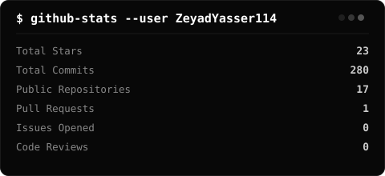
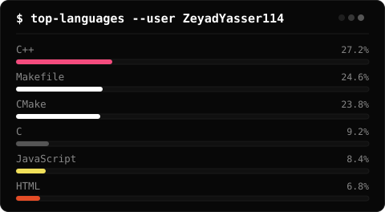
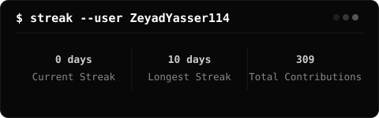

<!-- ══════════════════════════════════════════════════════════ -->
<!--                       HEADER                             -->
<!-- ══════════════════════════════════════════════════════════ --> 
<div align="center">
<p style="font-family: cursive; font-size: 18px; color: #cccccc; margin: 0 0 20px 0;">Software Engineer × Creator</p>
  
[](https://git.io/typing-svg)

<br/>

<a href="https://zeyadyasser114.github.io/">
  
</a>
<a href="mailto:zeyad2007.4y@gmail.com">
  
</a>
<a href="https://github.com/ZeyadYasser114">
  
</a>

</div>

<br/>

<!-- ══════════════════════════════════════════════════════════ -->
<!--                       ABOUT                              -->
<!-- ══════════════════════════════════════════════════════════ -->


```
╔═══════════════════════════════════════════════════════╗
║  $ whoami                                             ║
║                                                       ║
║  > Founder @ Meraki Studios                           ║
║  > Specializing in backend systems                    ║
║  > Backend AI Engineer @ FlyRank                      ║
║  > Open-source contributor                            ║
╚═══════════════════════════════════════════════════════╝
```


<br/>

<!-- ══════════════════════════════════════════════════════════ -->
<!--                    TECH STACK                            -->
<!-- ══════════════════════════════════════════════════════════ -->

<h2 align="center">⚡ Tech Stack</h2>

<h4 align="center">— Languages —</h4>
<p align="center">
  
  
  
  
  
  
</p>

<h4 align="center">— Tools & Platforms —</h4>
<p align="center">
  
  
  
  
  
</p>

<br/>


<!-- ══════════════════════════════════════════════════════════ -->
<!--                    GITHUB STATS                          -->
<!-- ══════════════════════════════════════════════════════════ -->

<h2 align="center">📊 System Metrics</h2>

<div align="center">
  
</div>

<br/>

<div align="center">
  
</div>

<br/>

<div align="center">
  
</div>

<br/>


<!-- ══════════════════════════════════════════════════════════ -->
<!--                     FOOTER                               -->
<!-- ══════════════════════════════════════════════════════════ -->

<div align="center">


</div>

</div>
